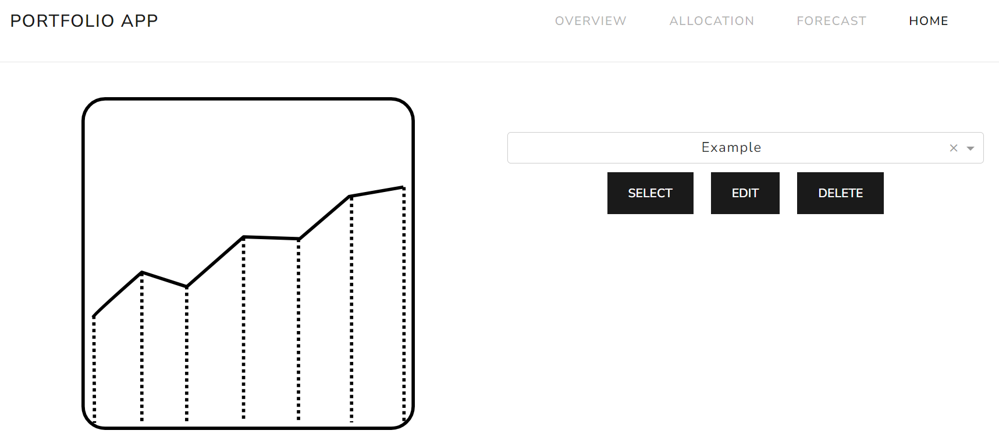
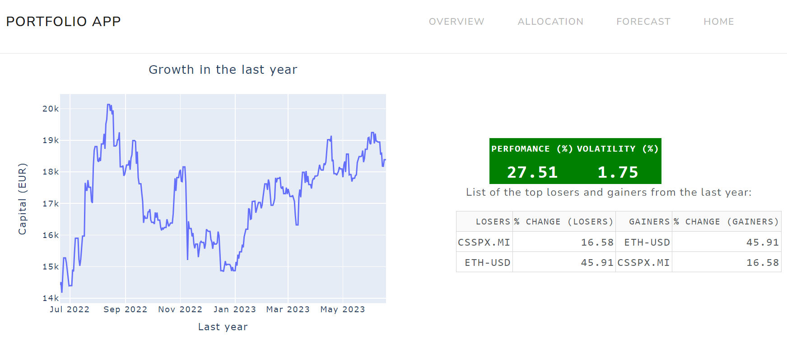
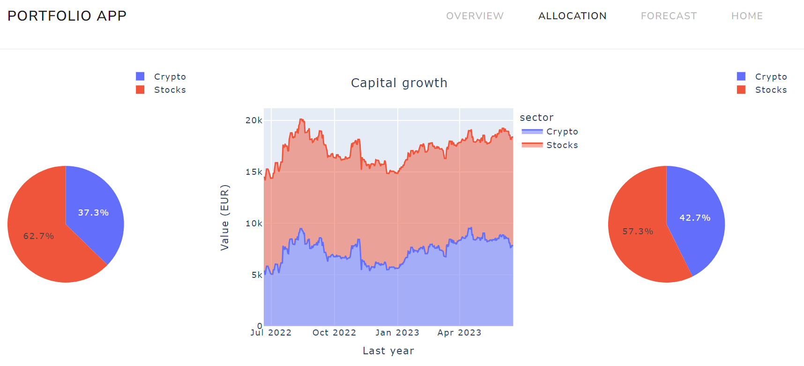
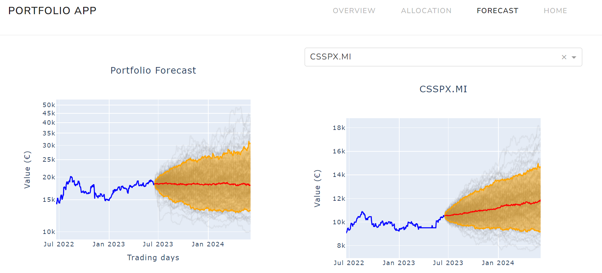

# Portfolio Dashboard

Visualize the current value and simulate the future evolution of the input Portfolio.
The repository is a personal test of different python libraries dash, copula, and pandas_datareader. 

## The portfolio

The portfolio(s) can be managed directly in the app and MongoDB gives persistence to the inputted data. Each asset of the portfolio relates to its ticker (YAHOO format), the number of shares owned, the currency of the assets and the sector (Stocks, Bonds, Sectors, Crypto, Currency, Commodity).

To start the app run the docker compose included in the subfolder mongo/
```
docker compose -f docker-compose-app.yaml up
```
if you cannot direcly retrieve the portfolio-app image through compose try first pulling the image from dockerhub:
```
docker pull arriba87/portfolio-app:latest
```


## Pages

For large portfolio it may take some times (~1 minute) to load the selected portfolio because the app downloads and runs simulations for the selected portfolio.
The dashboard includes 4 pages (/apps):
 1. Homepage. This page allows to manage the different portfolios, i.e. create, delete and edit new or existing portfolios.

 2. Overview. Perfomance of the portfolio in the last year, calculates percentage change and volatility (standard deviation of the relative changes). It shows also the top gainers and losers from the last year, useful to have an overview of the current market behaviour.


 3. Allocation. A comparison of the percentages of asset types in the portfolio in the last year. Useful in case you are adopting a rebalancing strategy.


 4. Forecast. Very simple simulation of the future values of each assets and of the overall portfolio. The simulation are based on the estimation of the Copula of the multivariate distribution of percentage changes in the previous year (so trust them for what they are).


